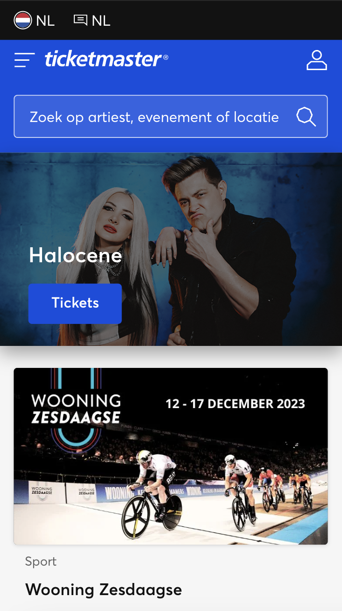
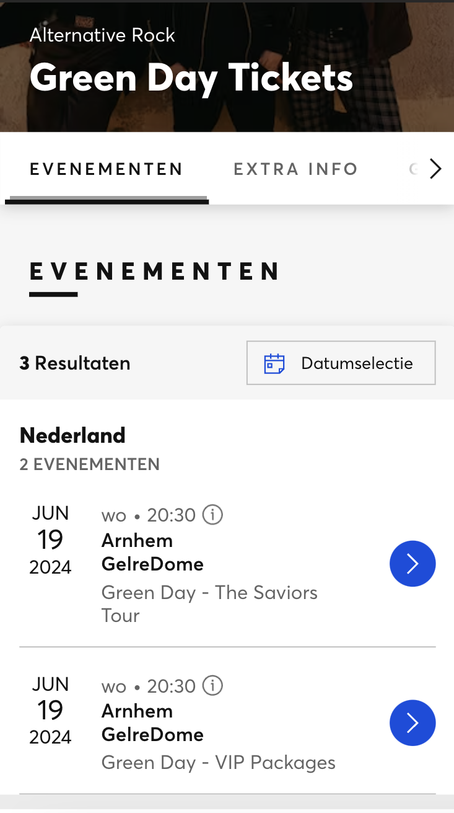

# Procesverslag
Markdown is een simpele manier om HTML te schrijven.  
Markdown cheat cheet: [Hulp bij het schrijven van Markdown](https://github.com/adam-p/markdown-here/wiki/Markdown-Cheatsheet).

Nb. De standaardstructuur en de spartaanse opmaak van de README.md zijn helemaal prima. Het gaat om de inhoud van je procesverslag. Besteedt de tijd voor pracht en praal aan je website.

Nb. Door *open* toe te voegen aan een *details* element kun je deze standaard open zetten. Fijn om dat steeds voor de relevante stuk(ken) te doen.

## Jij

  
uitwerken voor kick-off werkgroep

  ### Auteur:
  Famke Mulder

  #### Je startniveau:
  Startniveau blauw

  #### Je focus:
  Surface plane
 

## Je website

  
uitwerken voor kick-off werkgroep

  ### Je opdracht:
  https://www.ticketmaster.nl/

  #### Screenshot(s) van de eerste pagina (small screen): 
  Startscherm  
  

  #### Screenshot(s) van de tweede pagina (small screen):
  Concert datum kiezen
  
 

## Toegankelijkheidstest 1/2 (week 1)

  
uitwerken na test in 2e werkgroep

  ### Bevindingen
  Lijst met je bevindingen die in de test naar voren kwamen:

  Voor de toegankelijkheidstest heb ik verschillende disabilities getest op mijn gekozen site. Ik heb een blur-bril opgedaan waarmee ik het scherm slecht kon zien, maar ik heb ook elastiekjes om mijn vinngers gedaan om te kijken hoe het is om een motorieke beperking te hebben. Daarnaast heb ik ook nog een test afgenomen met een screenreader. Hiermee heb ik gekeken hoe het is om met deze screenreader te navigeren over mijn site. 
  
  Blur bril
  - Letters zijn onleesbaar
  - Grotere koppen zijn enigszins te ontcijferen
  - Plaatjes zijn wazig te zien, maar je kan er niet uithalen waar het over gaat

  Motorieke beperking (elastiekjes om je vingers)
  - Scrollen over de touchpad gaat redelijk
  - Inzoomen is onmogelijk met één hand
  - Ergens op klikken is lastig

  VoiceOver test ticketmaster
  - Featured kan je niet komen
  - Menu is makkelijk uit te vouwen met VoiceOver
  - Kalender spreekt elke datum uit, springt automatisch door naar volgende maand aan het einde van de vorige maand, is moeilijk om naar ‘apply’ te komen onder aan de kalender.
  - Inloggen is vrij easy, makkelijk te typen en je komt makkelijk bij de inlog knop, geeft goed aan als je iets verkeerd hebt ingevuld of als een veld verplicht is.
  - Headings is elk mogelijke artiest, niet per se kopjes. 

## Breakdownschets (week 1)

  
uitwerken na afloop 3e werkgroep

  ### de hele pagina: 
  

  ### dynamisch deel (bijv menu): 
  

  ### wellicht nog een dynamisch deel (bijv filter): 
  

## Voortgang 1 (week 2)

  
uitwerken voor 1e voortgang

  ### Stand van zaken
  Dit ging er goed en/of fout
  Ik vond het persoonlijk lastig om weer te beginnen met flexbox. Uiteindelijk is het wel gelukt met de oefening, maar ik wist eerst niet meer waar ik moest beginnen. Het hamburgermenu snapte ik zelf helemaal niet. Deze opdracht heb ik samen met Madelief gemaakt en uiteindelijk zijn we er wel uitgekomen, maar ik vond het erg lastig en ik snap eigenlijk nog steeds niet helemaal wat ik gedaan heb om het te laten werken. Ik heb een start gemaakt met mijn website en heb de navigatie in de html gezet. Verder dan dat ben ik op dit moment nog niet gekomen omdat ik vooral wilde oefenen met de opdrachten. 

  ### Agenda voor meeting
  samen met je groepje opstellen

  | student 1      | student 2          | student 3    | student 4        |
  | ---            | ---                | ---          | ---              |
  | dit bespreken  | en dit             | en ik dit    | en dan ik dat    |
  | en dat ook nog | dit als er tijd is | nog een punt | dit wil ik zeker |
  | ...            | ...                | ...          | ...              |

  ### Verslag van meeting
  hier na afloop snel de uitkomsten van de meeting vastleggen

  - punt 1
  - punt 2
  - nog een punt
  - ...

## Voortgang 2 (week 3)

  
uitwerken voor 2e voortgang

  ### Stand van zaken
  hier dit ging goed & dit was lastig (neem ook screenshots op van delen van je website en code)

  ### Agenda voor meeting
  samen met je groepje opstellen

  | student 1      | student 2          | student 3    | student 4        |
  | ---            | ---                | ---          | ---              |
  | dit bespreken  | en dit             | en ik dit    | en dan ik dat    |
  | en dat ook nog | dit als er tijd is | nog een punt | dit wil ik zeker |
  | ...            | ...                | ...          | ...              |

  ### Verslag van meeting
  hier na afloop snel de uitkomsten van de meeting vastleggen

  - punt 1
  - punt 2
  - nog een punt
- ...

## Toegankelijkheidstest 2/2 (week 4)

  
uitwerken na test in 9e werkgroep

  ### Bevindingen
  Lijst met je bevindingen die in de test naar voren kwamen (geef ook aan wat er verbeterd is):

## Voortgang 3 (week 4)

  
uitwerken voor 3e voortgang

  ### Stand van zaken
  hier dit ging goed & dit was lastig (neem ook screenshots op van delen van je website en code)

  ### Agenda voor meeting
  samen met je groepje opstellen

  | student 1      | student 2          | student 3    | student 4        |
  | ---            | ---                | ---          | ---              |
  | dit bespreken  | en dit             | en ik dit    | en dan ik dat    |
  | en dat ook nog | dit als er tijd is | nog een punt | dit wil ik zeker |
  | ...            | ...                | ...          | ...              |

  ### Verslag van meeting
  hier na afloop snel de uitkomsten van de meeting vastleggen

  - punt 1
  - punt 2
  - nog een punt
  - ...

## Eindgesprek (week 5)

  
uitwerken voor eindgesprek

  ### Je uitkomst - karakteristiek screenshots:
  

  ### Dit ging goed/Heb ik geleerd: 
  Korte omschrijving met plaatjes

  

  ### Dit was lastig/Is niet gelukt:
  Korte omschrijving met plaatjes

  

## Bronnenlijst

  
continu bijhouden terwijl je werkt

  Nb. Wees specifiek ('css-tricks' als bron is bijv. niet specifiek genoeg). 
  Nb. ChatGpT en andere AI horen er ook bij.
  Nb. Vermeld de bronnen ook in je code.

  1. bron 1
  2. bron 2
  3. ...

