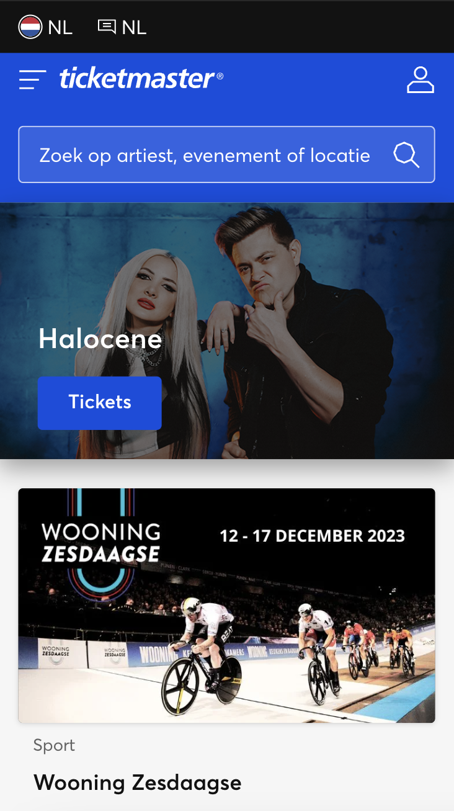
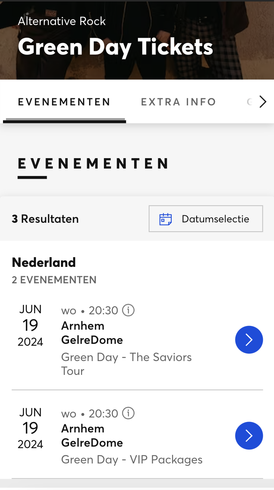
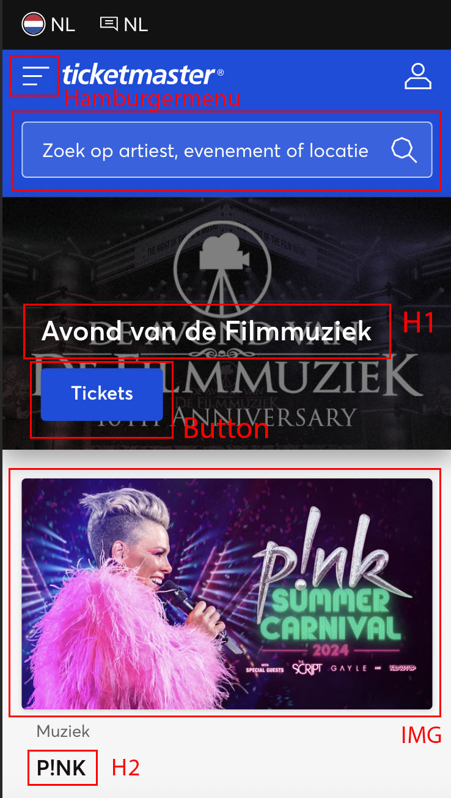
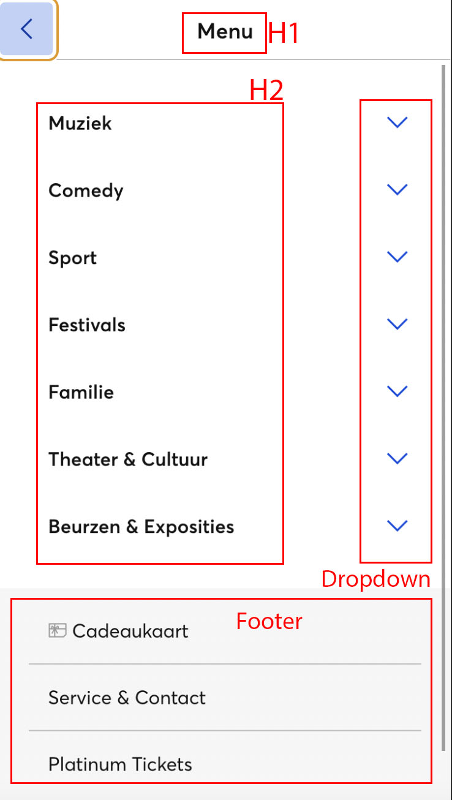
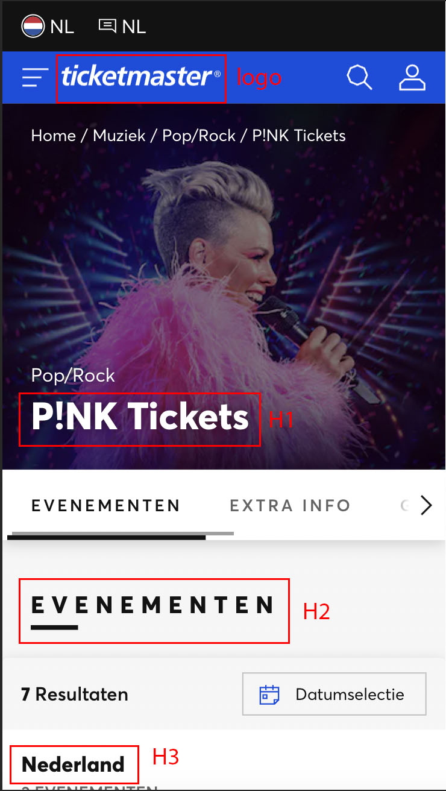
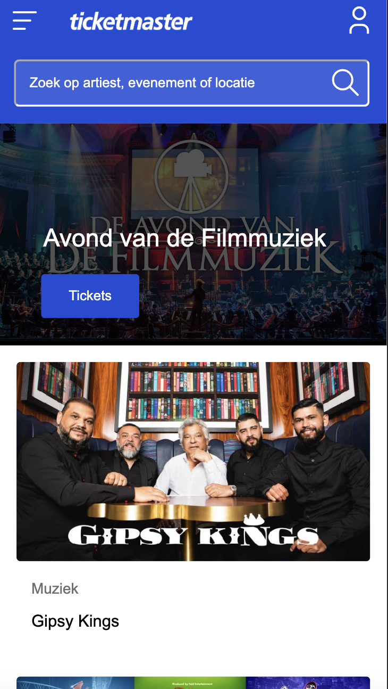
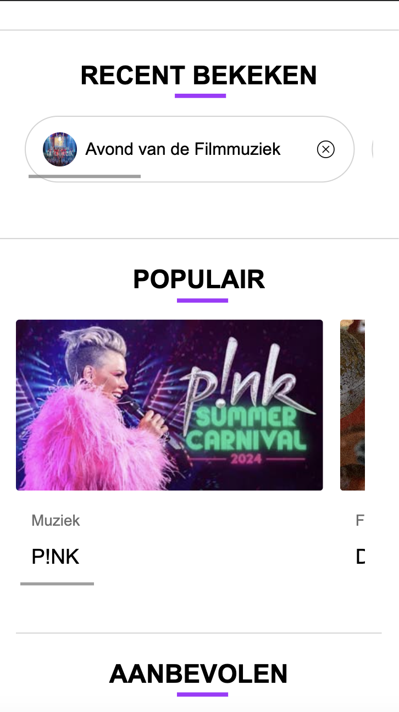
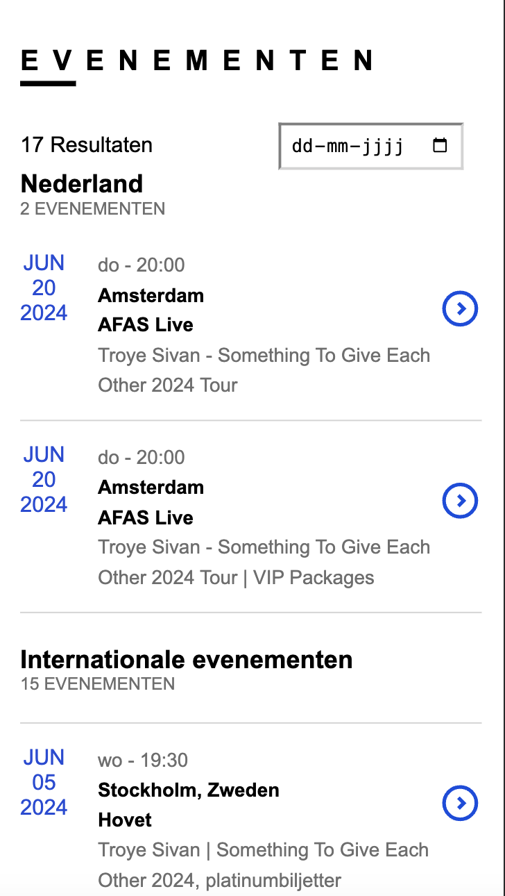
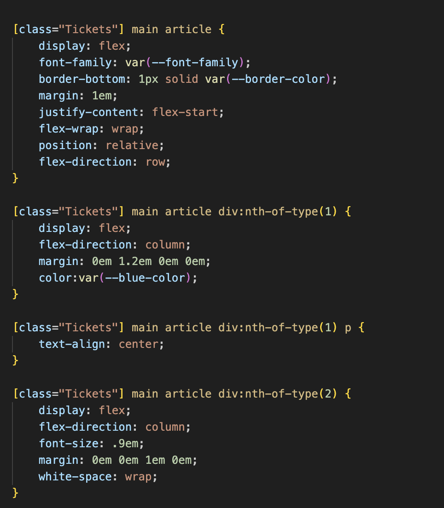
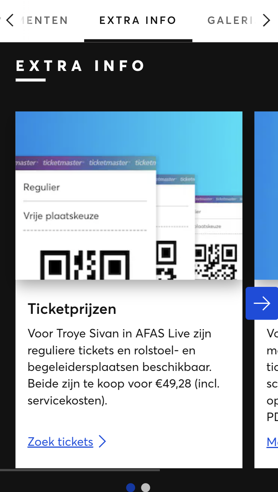

# Procesverslag
Markdown is een simpele manier om HTML te schrijven.  
Markdown cheat cheet: [Hulp bij het schrijven van Markdown](https://github.com/adam-p/markdown-here/wiki/Markdown-Cheatsheet).

Nb. De standaardstructuur en de spartaanse opmaak van de README.md zijn helemaal prima. Het gaat om de inhoud van je procesverslag. Besteedt de tijd voor pracht en praal aan je website.

Nb. Door *open* toe te voegen aan een *details* element kun je deze standaard open zetten. Fijn om dat steeds voor de relevante stuk(ken) te doen.

## Jij

  
uitwerken voor kick-off werkgroep

  ### Auteur:
  Famke Mulder

  #### Je startniveau:
  Startniveau blauw

  #### Je focus:
  Surface plane
 

## Je website

  
uitwerken voor kick-off werkgroep

  ### Je opdracht:
  https://www.ticketmaster.nl/

  #### Screenshot(s) van de eerste pagina (small screen): 
  Startscherm  
  

  #### Screenshot(s) van de tweede pagina (small screen):
  Concert datum kiezen
  
 

## Toegankelijkheidstest 1/2 (week 1)

  
uitwerken na test in 2e werkgroep

  ### Bevindingen
  Lijst met je bevindingen die in de test naar voren kwamen:

Voor de toegankelijkheidstest heb ik verschillende disabilities getest op mijn gekozen site. Ik heb een blur-bril opgedaan waarmee ik het scherm slecht kon zien, maar ik heb ook elastiekjes om mijn vingers gedaan om te kijken hoe het is om een motorieke beperking te hebben. Daarnaast heb ik ook nog een test afgenomen met een screenreader. Hiermee heb ik gekeken hoe het is om met deze screenreader te navigeren over mijn site.

Blur-bril
-Letters zijn onleesbaar
-Grotere koppen zijn enigszins te ontcijferen
-Plaatjes zijn wazig te zien, maar je kan er niet uithalen waar het over gaat

Motorieke beperking (elastiekjes om je vingers)
-Scrollen over de touchpad gaat redelijk
-Inzoomen is onmogelijk met één hand
-Ergens op klikken is lastig

VoiceOver test ticketmaster
-Featured kan je niet komen
-Menu is makkelijk uit te vouwen met VoiceOver
-Kalender spreekt elke datum uit, springt automatisch door naar volgende maand aan het einde van de vorige maand, is moeilijk om naar ‘apply’ te komen onder aan de kalender.
-Inloggen is vrij easy, makkelijk te typen en je komt makkelijk bij de inlog knop, geeft goed aan als je iets verkeerd hebt ingevuld of als een veld verplicht is.
-Headings is elk mogelijke artiest, niet per se kopjes.

## Breakdownschets (week 1)

  
uitwerken na afloop 3e werkgroep

  ### de hele pagina: 
  

  ### dynamisch deel (bijv menu): 
  

  ### wellicht nog een dynamisch deel (bijv filter): 
  

## Voortgang 1 (week 2)

  
uitwerken voor 1e voortgang

  ### Stand van zaken
  Dit ging er goed en/of fout:
  Ik vond het persoonlijk lastig om weer te beginnen met flexbox. Uiteindelijk is het wel gelukt met de oefening, maar ik wist eerst niet meer waar ik moest beginnen. Het hamburgermenu snapte ik zelf helemaal niet. Deze opdracht heb ik samen met Madelief gemaakt en uiteindelijk zijn we er wel uitgekomen, maar ik vond het erg lastig en ik snap eigenlijk nog steeds niet helemaal wat ik gedaan heb om het te laten werken. Ik heb een start gemaakt met mijn website en heb de navigatie in de html gezet. Verder dan dat ben ik op dit moment nog niet gekomen omdat ik vooral wilde oefenen met de opdrachten.

  ### Agenda voor meeting
  samen met je groepje opstellen

  Famke - javascript, hamburger menu.  
  Dian - javascript
  Niels - html, javascript.
  Quinty - hamburger menu
  Menno - kleine onderdelen op de website.

  ### Verslag van meeting
  hier na afloop snel de uitkomsten van de meeting vastleggen

  - Coderen gaat de goede kant op, goede start gemaakt met de html en css.
  - Ik kwam er niet uit om een zoekbalk toe te voegen aan mijn code. Dit kwam achteraf door een kleine spelfout.
  - Hamburger menu maken is gelukt
  - Vragen zijn beantwoord dus we kunnen allemaal verder met onze code. 

## Voortgang 2 (week 3)

  
uitwerken voor 2e voortgang

  ### Stand van zaken
  Dit ging er goed en/of fout: 
  Ik had deze week moeite met het maken van een hamburger menu, maar door terug te kijken naar de opdracht die ik had gemaakt kon ik terugkijken hoe ik het daar had gedaan. Samen met David heb ik gekeken hoe ik deze code het beste kon gebruiken in mijn eigen website en aangepast naar mijn kleuren. Ook heb ik de zoekbalk kunnen stijlen en deze gemaakt zodat die op ticketmaster zou passen. Verder heb ik stockfoto's toegevoegd aan mijn website zodat ik deze kon stijlen. Voor de bovenste foto heb ik terug gekeken naar de gemaakte opdrachten zodat ik tekst en een knop over deze foto kon zetten. 

  ### Agenda voor meeting
  samen met je groepje opstellen

  Famke - logo in zoekbalk zetten, slider maken, border balk kleiner maken.
  Dian - Footer / header
  Niels - verschillende vragen.

  ### Verslag van meeting
  hier na afloop snel de uitkomsten van de meeting vastleggen

  In deze meeting hebben we vooral de focus gelegd op vragen per persoon. We zaten deze week met de student assistenten, waardoor we goed konden verdelen wie waar over ging praten. Hierdoor konden we allemaal de kleine foutjes oplossen waar we mee zaten en makkelijk verder met onze website. 

## Toegankelijkheidstest 2/2 (week 4)

  
uitwerken na test in 9e werkgroep

  ### Bevindingen
  Lijst met je bevindingen die in de test naar voren kwamen (geef ook aan wat er verbeterd is):
  - Het is heel lastig om met tab aan te geven waar de gebruiker moet zijn op de website. Doordat mijn onderdelen geen link hebben, kon ik er niet overheen bewegen met tab waardoor ik meer in google chrome aan het klikken was dan op mijn website.
  - Met de screenreader was het opzich wel te doen om over de website te navigeren. De screenreader las de header en stukken tekst op en ik wist gelijk waar ik op stond.
  - De screenreader navigeerde niet in mijn hamburger menu.

## Voortgang 3 (week 4)

  
uitwerken voor 3e voortgang

  ### Stand van zaken
  hier dit ging goed & dit was lastig (neem ook screenshots op van delen van je website en code)

  ### Agenda voor meeting
  samen met je groepje opstellen

  Famke - css regel 'werkt niet', tekst gaan niet naast elkaar. 
  Dian - Javascript stoel selecteren.
  Niels - Automatisch horizontaal scrollen.

  ### Verslag van meeting
  hier na afloop snel de uitkomsten van de meeting vastleggen

  - We hadden allemaal kleine vraagjes en konden deze om en om stellen. De dingen die we wilden weten zijn gelukt en we konden makkelijk verder met onze opdracht. Steeds als iemand hun vraag stelde was de rest rustig aan het werk en wanneer dat kon stelde iedereen een vraag. Het was voor mijn gevoel een relaxte meeting, dus dat vond ik erg prettig.

## Eindgesprek (week 5)

  
uitwerken voor eindgesprek

  ### Je uitkomst - karakteristiek screenshots:
  
  
  
  

  ### Dit ging goed/Heb ik geleerd: 
  Ik heb geleerd hoe ik 2 verschillende onderdelen naast elkaar kan zetten met behulp van div.

  
  

  ### Dit was lastig/Is niet gelukt:
  Op de originele ticketmaster website staat een blokje met extra informatie over het concert, maar het is mij niet gelukt om deze na te maken.

  

## Bronnenlijst

  
continu bijhouden terwijl je werkt

  Nb. Wees specifiek ('css-tricks' als bron is bijv. niet specifiek genoeg). 
  Nb. ChatGpT en andere AI horen er ook bij.
  Nb. Vermeld de bronnen ook in je code.

  1. Ticketmaster NL, Business. (2023, 29 augustus). Ticketmaster huisstijl - Ticketmaster Nederland. Ticketmaster Nederland. https://business.ticketmaster.nl/ticketmaster-huisstijl/
  2. Febre, A. L. (2022, 30 september). Extra kaarten voor matineeshow De Avond van de filmmuziek in de Ziggo Dome - Entertainment Business. Entertainment Business. https://www.entertainmentbusiness.nl/live/extra-kaarten-voor-matineeshow-de-avond-van-de-filmmuziek-in-de-ziggo-dome/

