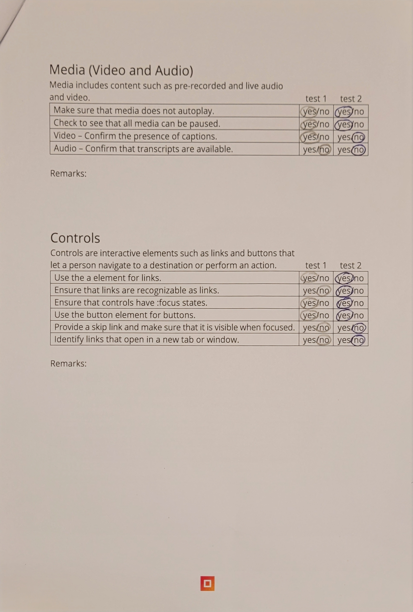

# Procesverslag
Markdown is een simpele manier om HTML te schrijven.  
Markdown cheat cheet: [Hulp bij het schrijven van Markdown](https://github.com/adam-p/markdown-here/wiki/Markdown-Cheatsheet).

Nb. De standaardstructuur en de spartaanse opmaak van de README.md zijn helemaal prima. Het gaat om de inhoud van je procesverslag. Besteedt de tijd voor pracht en praal aan je website.

Nb. Door *open* toe te voegen aan een *details* element kun je deze standaard open zetten. Fijn om dat steeds voor de relevante stuk(ken) te doen.

## Jij

  
uitwerken voor kick-off werkgroep

  ### Auteur:
  Famke Mulder

  #### Je startniveau:
  Startniveau blauw

  #### Je focus:
  Surface plane
 

## Je website

  
uitwerken voor kick-off werkgroep

  ### Je opdracht:
  https://www.ticketmaster.nl/

  #### Screenshot(s) van de eerste pagina (small screen): 
  Startscherm  
  

  #### Screenshot(s) van de tweede pagina (small screen):
  Concert datum kiezen
  
 

## Toegankelijkheidstest 1/2 (week 1)

  
uitwerken na test in 2e werkgroep

  ### Bevindingen
  Lijst met je bevindingen die in de test naar voren kwamen:

Voor de toegankelijkheidstest heb ik verschillende disabilities getest op mijn gekozen site. Ik heb een blur-bril opgedaan waarmee ik het scherm slecht kon zien, maar ik heb ook elastiekjes om mijn vingers gedaan om te kijken hoe het is om een motorieke beperking te hebben. Daarnaast heb ik ook nog een test afgenomen met een screenreader. Hiermee heb ik gekeken hoe het is om met deze screenreader te navigeren over mijn site.

Blur-bril
-Letters zijn onleesbaar
-Grotere koppen zijn enigszins te ontcijferen
-Plaatjes zijn wazig te zien, maar je kan er niet uithalen waar het over gaat

Motorieke beperking (elastiekjes om je vingers)
-Scrollen over de touchpad gaat redelijk
-Inzoomen is onmogelijk met één hand
-Ergens op klikken is lastig

VoiceOver test ticketmaster
-Featured kan je niet komen
-Menu is makkelijk uit te vouwen met VoiceOver
-Kalender spreekt elke datum uit, springt automatisch door naar volgende maand aan het einde van de vorige maand, is moeilijk om naar ‘apply’ te komen onder aan de kalender.
-Inloggen is vrij easy, makkelijk te typen en je komt makkelijk bij de inlog knop, geeft goed aan als je iets verkeerd hebt ingevuld of als een veld verplicht is.
-Headings is elk mogelijke artiest, niet per se kopjes.

## Breakdownschets (week 1)

  
uitwerken na afloop 3e werkgroep

  ### de hele pagina: 
  

  ### dynamisch deel (bijv menu): 
  

  ### wellicht nog een dynamisch deel (bijv filter): 
  

## Voortgang 1 (week 2)

  
uitwerken voor 1e voortgang

  ### Stand van zaken
  Dit ging er goed en/of fout:
  Ik vond het lastig om de basiscode weer op te pakken. Ik heb dit in jaar 1 wel geleerd, maar het was eigenlijk allemaal weer uit mijn hoofd verdwenen. Samen met een klasgenoot heb ik de opdracht van het hamburgermenu gemaakt en uiteindelijk zijn we hier samen uitgekomen, maar het heeft wel even geduurt. Ik snap nu hoe dit werkt en welke code ik moet gebruiken om deze aan te roepen. 

  Ook heb ik een start gemaakt met mijn website en heb ik de navigatie in de html gezet. Verder ben ik op dit moment nog niet gekomen omdat ik mij voornamelijk wilde focussen op de opdrachten om het coderen zelf beter te begrijpen. 

  ### Agenda voor meeting
  samen met je groepje opstellen

  Famke - javascript, hamburger menu.  
  Dian - javascript
  Niels - html, javascript.
  Quinty - hamburger menu
  Menno - kleine onderdelen op de website.

  ### Verslag van meeting
  hier na afloop snel de uitkomsten van de meeting vastleggen

  - Coderen gaat de goede kant op, goede start gemaakt met de html en css.
  - Ik kwam er niet uit om een zoekbalk toe te voegen aan mijn code. Dit kwam achteraf door een kleine spelfout.
  - Opdracht van het hamburger menu maken is gelukt
  - Vragen zijn beantwoord dus we kunnen allemaal verder met onze code. 

## Voortgang 2 (week 3)

  
uitwerken voor 2e voortgang

  ### Stand van zaken
  Aan de hand van de opdracht over het hamburgermenu heb ik deze nu toegevoegd aan mijn eigen website. Ik heb hierbij gekeken naar de code uit de opdracht en hoe ik deze het beste kon gebruiken in mijn eigen website. Ik heb de zoekbalk kunnen stijlen zodat deze op de Ticketmaster website past.

  Verder ben ik begonnen met stockfoto's toevoegen zodat ik precies kon meten hoe de echte foto's moesten komen staan en dat ik deze alvast kon stijlen. Voor de bovenste foto heb ik terug gekeken naar de gemaakte opdrachten zodat ik tekst en een knop over deze foto kon zetten. 

  ### Agenda voor meeting
  samen met je groepje opstellen

  Famke - logo in zoekbalk zetten, slider maken, border balk kleiner maken.
  Dian - Footer / header
  Niels - verschillende vragen.

  ### Verslag van meeting
  hier na afloop snel de uitkomsten van de meeting vastleggen

  In deze meeting hebben we vooral de focus gelegd op vragen per persoon. We zaten deze week met de student assistenten, waardoor we goed konden verdelen wie waar over ging praten. Hierdoor konden we allemaal de kleine foutjes oplossen waar we mee zaten en makkelijk verder met onze website. 

## Toegankelijkheidstest 2/2 (week 4)

  
uitwerken na test in 9e werkgroep

  ### Bevindingen
  Lijst met je bevindingen die in de test naar voren kwamen (geef ook aan wat er verbeterd is):
  - Het is heel lastig om met tab aan te geven waar de gebruiker moet zijn op de website. Doordat mijn onderdelen geen link hebben, kon ik er niet overheen bewegen met tab waardoor ik meer in google chrome aan het klikken was dan op mijn website.
  - Met de screenreader was het opzich wel te doen om over de website te navigeren. De screenreader las de header en stukken tekst op en ik wist gelijk waar ik op stond.
  - De screenreader navigeerde niet in mijn hamburger menu.

## Voortgang 3 (week 4)

  
uitwerken voor 3e voortgang

  ### Stand van zaken
  Dit ging goed & dit was lastig
  Ik heb als eerste de stockfoto's vervangen voor de originele foto's en ervoor gezorgd dat deze passen in de stijling die ik de stockfoto's had gegeven. Daarna heb ik de sliders gemaakt en de kleine foto's hieraan toegevoegd. Ik vond het zelf lastig om deze sliders te maken omdat ik dit nog niet eerder had gedaan, maar met een beetje hulp van mijn klasgenoten is dit gelukt. 

  Toen ik de sliders had vormgegeven, ben ik verder gegaan met de footer in elkaar zetten. Deze was vooral veel tekst onder elkaar, afscheidings lijnen ertussen en een aantal icoontjes met flexbox naast elkaar zetten. Dit ging voor mij al een stuk beter omdat ik hier op de eerste pagina meer mee heb geoefend. 

  Vlak hierna kon ik beginnen met de tweede pagina en heb ik hier een class voor aangemaakt zodat ik deze makkelijker kon stijlen zonder dat ik de eerste pagina aanpaste. De banner hiervan heb ik op dezelfde manier gemaakt als die op de eerste pagina, dus kon ik de code hiervan hergebruiken. 

  Waar ik het meeste moeite mee had op deze pagina was het naast elkaar krijgen van de tekst bij de tour data. Ik heb dit geprobeert met flexbox, maar het lukte niet zoals ik dit wilde. Uiteindelijk ben ik hierdoor uitgekomen bij een 
, waarmee het wel lukte. In deze div's heb ik per stukje tekst een 
 aangemaakt zodat ik deze ook per onderdeel kon aanpassen. 

  Verder ben ik bezig geweest met het toevoegen van video's aan mijn website, zodat de gebruiker kan zien wie de artiest is en wat voor muziek diegene maakt. Het was voor mij even zoeken omdat ik nog niet eerder video's had gebruikt, maar zodra ik de code hiervoor had gevonden, vond ik het erg makkelijk. 

  Alle andere onderdelen die verder nog op deze pagina stonden, waren makkelijker om te maken, aangezien ik deze al vaker had gebruikt in deze opdracht. 

  Als laatste ben ik gaan kijken wat ik kon toevoegen qua service plane. Ik ben hierbij op animaties uitgekomen en heb er voor gekozen om de bovenste kop te laten springen als de gebruiker er overheen gaat met de muis, en om de onderste 'koop tickets' button ook te laten springen. Hierdoor is deze bijna onmisbaar voor de gebruiker. 

  Verder heb ik hover en focus states toegevoegd aan de knoppen op de gehele website, en zodra de gebruiker eroverheen gaat met tab komt er een roze lijntje om de onderdelen heen. Zo weet de gebruiker waar deze zich bevindt op de website. 

  De laatste toevoeging die ik heb gedaan aan de website is het toevoegen van light/darkmode. Zodra de laptop van de gebruiker in darkmode staat, wordt mijn website ook darkmode, en andersom natuurlijk. Hierdoor moest ik een aantal kleine aanpassingen maken in de kleuren die ik heb gebruikt en een aantal variabelen toevoegen. 

  ### Agenda voor meeting
  samen met je groepje opstellen

  Famke - css regel 'werkt niet', tekst gaan niet naast elkaar. 
  Dian - Javascript stoel selecteren.
  Niels - Automatisch horizontaal scrollen.

  ### Verslag van meeting
  hier na afloop snel de uitkomsten van de meeting vastleggen

  - We hadden allemaal kleine vraagjes en konden deze om en om stellen. De dingen die we wilden weten zijn gelukt en we konden makkelijk verder met onze opdracht. Steeds als iemand hun vraag stelde was de rest rustig aan het werk en wanneer dat kon stelde iedereen een vraag. Het was voor mijn gevoel een relaxte meeting, dus dat vond ik erg prettig.

## Eindgesprek (week 5)

  
uitwerken voor eindgesprek

  ### Je uitkomst - karakteristiek screenshots:
  
  
  
  

  ### Dit ging goed/Heb ik geleerd: 
  2 verschillende onderdelen naast elkaar zetten met behulp van div.

  
  

  Een hamburger menu in elkaar zetten

  

  Light/darkmode toevoegen

  
  

  Hover en focus states toepassen

  
  
  

  Videos toevoegen aan de website

  

  Sliders toevoegen

  

  ### Dit was lastig/Is niet gelukt:
  Op de originele ticketmaster website staat een blokje met extra informatie over het concert, maar het is mij niet gelukt om deze na te maken.

  

  De originele ticketmaster heeft onderaan de pagina waar je kaartjes kan kopen voor een artiest een aftelfunctie die aangeeft hoe lang het nog duurt voordat het eerste concert in Nederland plaatsvind. Dit is mij niet gelukt om te maken en eerlijk gezegd heb ik het ook niet geprobeert. 

  

## Bronnenlijst

  
continu bijhouden terwijl je werkt

  Nb. Wees specifiek ('css-tricks' als bron is bijv. niet specifiek genoeg). 
  Nb. ChatGpT en andere AI horen er ook bij.
  Nb. Vermeld de bronnen ook in je code.

  1. Ticketmaster NL, Business. (2023, 29 augustus). Ticketmaster huisstijl - Ticketmaster Nederland. Ticketmaster Nederland. https://business.ticketmaster.nl/ticketmaster-huisstijl/
  2. Febre, A. L. (2022, 30 september). Extra kaarten voor matineeshow De Avond van de filmmuziek in de Ziggo Dome - Entertainment Business. Entertainment Business. https://www.entertainmentbusiness.nl/live/extra-kaarten-voor-matineeshow-de-avond-van-de-filmmuziek-in-de-ziggo-dome/

